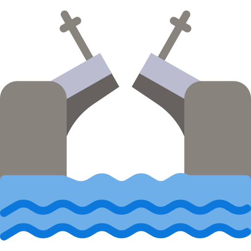

<h1 align="center">🇭🇮 🇹🇭🇪🇷🇪, 🇮❜🇲 🇧🇴🇷🇮🇸 &#128075</h1>
<h3 align="center" style="color: #ff00ff ">Frontend developer</h3>
<h3 align="center"></h3>
<h4>&#128161 Briefly about me</h4>

I develop the interface of the platform for marketplace analytics at RocketSeller and teach JavaScript at the JetCode network of programming schools.

I love frontend for the opportunity to combine engineering logic with creativity.

I am inspired by the convenience of development and the speed of applications on React. I am actively learning myself and sharing my knowledge as a mentor.

I am always open to new career opportunities!

<h4>&#128208 Languages & tools I use</h4>
<table style="border-collapse: collapse;">
        <tbody style="border: none;">
        <tr style="border: none;">
            <td style="border: none; padding: 10px;"></td>
            <td style="border: none; padding: 10px;"></td>
            <td style="border: none; padding: 10px;"></td>
            <td style="border: none; padding: 10px;"></td>
            <td style="border: none; padding: 10px;"></td>
            <td style="border: none; padding: 10px;"></td>
            <td style="border: none; padding: 10px;"></td>
        </tr>
        <tbody/>
    </table>
<h4>&#127757; My homeland</h4>
<table style="border-collapse: collapse;">
        <tr style="border: none;">
            <td style="border: none; padding: 10px;"></td>
            <td style="border: none; padding: 10px;">
Russian Federation
</td>
        </tr>
</table>
<h4>&#128205; My current location</h4>
<table style="border-collapse: collapse;">
        <tr style="border: none;">
            <td style="border: none; padding: 10px;"></td>
            <td style="border: none; padding: 10px;">
Saint-Petersburg
</td>
        </tr>
</table>
<a href="mailto:borisbutorin.main@gmail.com" target="_blank">&#128231; e-mail me</a> 
<a href="https://t.me/Boris_Butorin" target="_blank">&#128172; contact me</a>

