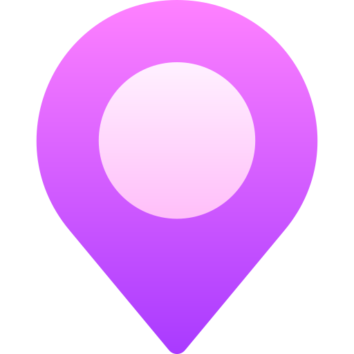

<h2 align="center">🇭🇮 🇹🇭🇪🇷🇪, 🇮❜🇲 🇧🇴🇷🇮🇸 </h2>

Junior frontend developer

<h4><b>&#127993 My inspiration</b></h4>

I'm an aspiring front-end developer with a passion for creating beautiful and functional web interfaces. I constantly learn new technologies and strive to improve my skills &#128187;

<h4><b>&#128218 I’m currently learning</b></h4>

The full power of REACT &#129470;

<h4><b>&#128208 Languages & tools I use</b></h4>
<table style="border-collapse: collapse;">
        <tr style="border: none;">
            <td style="border: none; padding: 10px;"></td>
            <td style="border: none; padding: 10px;"></td>
            <td style="border: none; padding: 10px;"></td>
            <td style="border: none; padding: 10px;"></td>
            <td style="border: none; padding: 10px;"></td>
            <td style="border: none; padding: 10px;"></td>
        </tr>
    </table>

<b>&#127757; My homeland</b>

 Russian Federation

<h4><b>&#128205; My current location</b></h4>

Saint-Petersburg

<a href="mailto:butorinb.g.main@gmail.com" style="text-decoration: none !important; color: white !important;">&#128231; e-mail me</a> 
<a href="https://t.me/Boris_Butorin" style="text-decoration: none !important; color: white !important;">&#128172; contact me</a>

